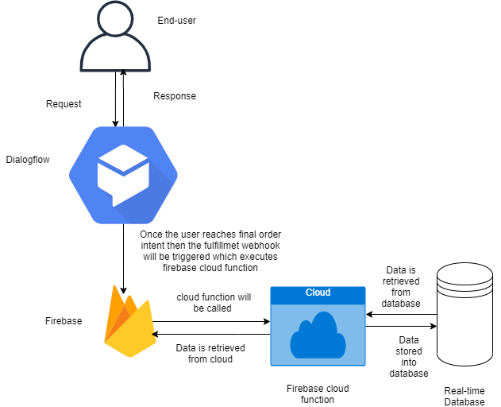
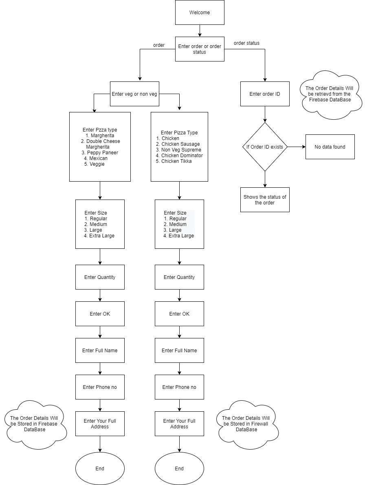

###                    Instructions to use the Pizza Ordering chatbot 
1.	You can start conversation with greetings like hi, hello or else you can directly start with order pizza, I want to order etc.
2.	It will show the response as you have to select veg or non veg type.
3.	If you select veg type it will display the types of veg pizza’s and select one of them. If you select non veg type it will display the types of non veg pizza’s and select one of them.
4.	After selecting the Pizza name it will give response as select the size of pizza you want. In this chat bot I added regular, medium, large and extra large sizes.
5.	After selecting the pizza size you have to choose the quantity means how many pizza’s you want.
6.	After entering the quantity it will give response with which size you selected and which pizza name you selected along with “Type OK”. If you enter “OK” the order will be     confirmed. If you don’t want that pizza you can start with order pizza type.
7.	If you enter “OK” it will give prompt as enter full name. While entering full name you have to enter like this “my name is <name>”.
8.	After entering your name it will ask your phone no and then it will ask your full address.
9.	After entering all the details a unique orderID and all the order details stored in firebase database. It will give response with your orderID along with your name and order particulars.
10.	If you want to track your order, you have to remember your orderId then enter order status or track my order etc.
11.	After that it will asks you to enter your orderID. If that OrderId is available in the database it will show your order status else it will show you as the data not available.
12.	After completing all these if you want to order again then again you can enter order Pizza.
  
**NOTE:** While entering your name please enter “My name is (&lt)name(&gt) “ in this format.
  
### Architecture for Pizza Ordering chatbot

### Flowchart for Pizza Orderring chatbot

